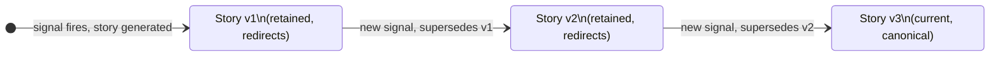
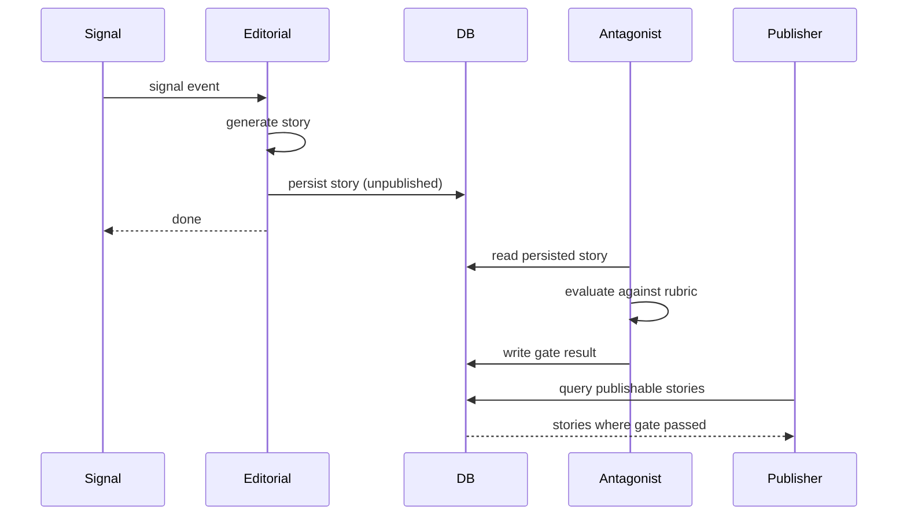

# AIDRAN: Methodology

## Abstract

AIDRAN is a continuous discourse-intelligence system specialized in artificial intelligence as a subject domain. It ingests public discourse from nine source kinds, enriches records with entity and topic analysis, detects signals when the shape of conversation changes, and generates source-attributed versioned stories. This document describes the design approach, the rationale for key pattern choices, and the boundary between what this scaffold publishes and what remains proprietary.

---

## 1. The Problem: Fragmented AI Discourse at Continuous Scale

The public conversation about artificial intelligence is distributed, fast-moving, and structurally heterogeneous. A single development — a model release, a safety incident, a policy announcement — may surface simultaneously on academic preprint servers, developer forums, social platforms, video commentary, and news aggregators. Each surface applies its own framing, timing, and level of technical fluency.

Existing approaches to tracking this discourse face a common limitation: they are optimized for retrieval (find documents matching a query) or for brand-monitoring (track mentions of a named entity). Neither model captures how a *subject* moves. A query-retrieval system returns documents; it does not tell you whether the conversation has shifted since last week. A brand-monitor tracks whether a company name appears; it does not tell you whether the framing of that company's technology has changed across sources.

The pattern AIDRAN is built around is more akin to how a beat journalist operates over time: accumulate records, recognize when the accumulated record has changed materially, and produce a narrative summary that cites the evidence. The challenge is making this continuous and computationally tractable.

AIDRAN's design answers three questions:

1. How do you determine that a signal is real rather than noise?
2. How do you produce a story that cites its sources without drifting toward generic summarization?
3. How do you prevent the system from repeating itself as the corpus grows?

---

## 2. The Approach

### 2.1 Evidence-Joined Signals

A *signal* in AIDRAN is not a score. It is a structured record that joins the topic or entity it concerns to the specific corpus records that justify it. Every signal carries a `signal_evidence` join: the records that caused this signal to fire.

This design has three consequences. First, signals can be audited — a human or automated reviewer can inspect exactly which records supported a novelty or velocity determination. Second, signals are defensible in editorial workflows — a story generated from a signal can trace its claims to specific sources. Third, false signals are diagnosable — if a signal fires incorrectly, the evidence join shows which records were weighted too heavily.

Signal detection operates across three dimensions:

- **Novelty**: Records associated with a topic are embedded and compared to the existing corpus. High distance from recent records is a candidate novelty signal. The embedding comparison is done against the topic centroid and against a baseline of recent records rather than against the full corpus, which keeps the computation tractable.
- **Velocity**: Record volume for a topic over a short window is compared to a rolling baseline. A sustained spike above baseline is a velocity signal.
- **Divergence**: Sentiment is estimated per source and compared across sources. Divergence signals fire when sources disagree materially — indicating a contested or actively-developing story rather than a stable consensus.

All three signal types require minimum evidence thresholds before they can fire. The thresholds are calibrated values that are not published in this scaffold.

### 2.2 Append-Only Versioned Story Chains

Each story AIDRAN generates is a node in an append-only chain. A story is never edited in place. When new signal justifies an update, a new story version is generated that *supersedes* the previous one. The superseded version is retained; its slug redirects to the current version.

This pattern has four properties:

**Traceability.** Every version of a story is associated with the signals and records that produced it. You can inspect the exact state of the corpus at the moment any version was generated.

**Attribution stability.** Readers who link to a slug always reach the current version, but the historical chain is preserved for research purposes.

**Graceful degradation.** A story at version 1 is still a publishable story. The system does not require a "complete" corpus before it can produce output. Each version improves on the last as the corpus accumulates.

**Auditability.** Because versions are never destroyed, quality regressions can be identified and compared across the chain.

The pattern treats versioning as a first-class citizen rather than an implementation detail. This is unusual in content management — most CMS designs treat a story as a single mutable document — but it is natural in an append-only corpus where the underlying evidence changes continuously.

### 2.3 Antagonist-After-Persist Quality Gate

LLM-based generation at continuous scale surfaces a well-known failure mode: the model generates plausible-sounding but poorly-grounded text. The usual mitigation is to evaluate before persisting — inspect the output, score it, discard if below threshold. AIDRAN uses a different pattern.

The antagonist gate runs **after** the story is persisted to the database, not before. This is intentional.

The reasons are:

1. **Latency.** A pre-persist evaluation gate adds latency to every generation event. For a continuous pipeline that generates stories on signal, this latency compounds at scale.
2. **Reversibility.** A persisted story can be suppressed from publication if the gate fails. Nothing is lost. The generation work is not wasted, and the story remains in the corpus for diagnostic purposes.
3. **Independence.** The antagonist judge evaluates the persisted story independently, without access to the generation parameters. This structural independence prevents the judge from being influenced by generation-time reasoning.

The antagonist judge is an LLM-based evaluator with a rubric. The rubric dimensions and weights are proprietary. What is publishable is the pattern: a non-blocking adversarial evaluator that runs on persisted output and gates publication, not generation.

Stories that fail the antagonist gate are flagged in the database. A suppressed story can be regenerated, passed to a human reviewer, or used as training signal for quality improvement.

### 2.4 Pattern-Saturation Feedback Loop

A continuous editorial system operating over a long time period tends toward repetition. The corpus accumulates stories about the same recurring themes; the generation model draws on similar framing repeatedly; readers encounter paraphrases of stories they have already read.

AIDRAN addresses this with a pattern-saturation feedback loop. The loop operates at the editorial level: before a story is generated, the system evaluates whether the proposed topic and framing are sufficiently distinct from recent output. If the topic has been covered recently and no materially new evidence has arrived, the signal is suppressed.

The loop has two components. The first is a similarity check against recent stories: new story candidates are compared against a window of recent published output. The second is a dynamic suppression list maintained by the system over time, accumulated from the pattern of what has been generated. This list is not static — it grows and shrinks as the corpus evolves.

The suppression list and its calibration are proprietary. What is published in this scaffold is the structural pattern: a feedback loop from generated output back to signal qualification, preventing signal from firing on already-saturated patterns.

### 2.5 Source-with-Cursor Task Pattern

AIDRAN ingests from nine source kinds: Reddit, Bluesky, Hacker News, Google News, YouTube, arXiv, X (direct API), Exa full-text search, and Exa Websets. Each source has different rate limits, pagination models, and data shapes.

The source-with-cursor pattern unifies ingestion across all sources behind a common interface. Each ingestion task:

1. Reads its last cursor from the database (a timestamp, page token, or offset specific to the source)
2. Fetches the next page of records since the cursor
3. Writes normalized records to the corpus
4. Writes the new cursor back to the database

This pattern provides several properties:

- **Resumability.** If an ingestion task fails mid-run, the next run starts from the last committed cursor. No records are silently skipped.
- **Idempotence.** Re-running a task with the same cursor produces the same result.
- **Observability.** Cursor lag (distance between the cursor and current time) is a direct measure of ingestion health.
- **Source isolation.** Each source's cursor is independent. A rate-limit on one source does not affect others.

The Hacker News adapter included in this scaffold is a reference implementation of the pattern.

---

## 3. Design Rationale

### Why not a fine-tuned model?

AIDRAN uses general-purpose LLM-based generation with structured prompting and an independent quality gate rather than a fine-tuned model. The rationale is pragmatic: fine-tuning requires a labeled training corpus and retraining cycles. The pattern-saturation and antagonist systems can evolve without retraining, which is important for a continuously operating system. The tradeoff is that prompt and rubric design become critical operational concerns — which is why they are treated as trade secrets.

### Why Postgres with pgvector, not a dedicated vector database?

The corpus data (records, stories, entities, topics, signals) has a natural relational structure. Signals join to evidence; stories join to signals; entities join to records via mention tables. A dedicated vector database would require either duplicating this structure or maintaining a foreign-key equivalent across two systems. Postgres with pgvector keeps the corpus in a single consistent store. The embedding queries AIDRAN runs — centroid comparison, nearest-neighbor lookup over a bounded topic subset — are well within pgvector's operational envelope.

### Why append-only versioning rather than CMS-style drafts?

Draft/publish workflows in CMS systems are designed around human editorial workflows: a writer creates a draft, an editor reviews it, it is published. AIDRAN's editorial pipeline is automated. The meaningful distinction is not draft vs. published; it is *which version* is canonical. Append-only chains preserve all versions and make the canonical pointer a matter of database state rather than a separate approval workflow.

### Why Render Workflows rather than a task queue?

Render Workflows provide durable execution with built-in retry and observability without requiring a separate queue service. The tradeoff is less flexibility than a general-purpose task queue. AIDRAN's ingestion and signal-detection tasks are well-modeled as periodic workflows rather than event-driven queues, so the fit is reasonable.

---

## 4. What Is in This Scaffold vs. Proprietary

The patterns described in this document are all represented in the scaffold code with varying degrees of completeness:

| Pattern | Scaffold status |
|---|---|
| Evidence-joined signals | Reference implementation included |
| Append-only versioned story chains | Schema and type definitions included |
| Antagonist-after-persist quality gate | Pattern documented; rubric omitted |
| Pattern-saturation feedback loop | Pattern documented; suppression list omitted |
| Source-with-cursor task pattern | Hacker News reference adapter included |

What is intentionally omitted, per `NOTICE.md`:

- LLM prompt templates for story generation
- Antagonist and quality judge rubrics and weights
- Calibrated thresholds for novelty, velocity, and divergence signals
- Prompt exemplars and echo-detection corpus
- Pattern-saturation history and learned suppression lists

These omissions are not incidental. They represent the accumulated operational learning that makes AIDRAN's output distinct. The patterns are generic enough to study and extend. The calibration is not.

---

## 5. References

AIDRAN is informed by a range of prior work in computational journalism, discourse analysis, and information retrieval. The following are relevant touchstones, not exhaustive citations.

- Boydstun, A.E. (2013). *Making the News: Politics, the Media, and Agenda Setting*. On how agenda-setting operates across media sources — the conceptual precursor to divergence signal detection.
- Leskovec, J., Backstrom, L., & Kleinberg, J. (2009). "Meme-tracking and the dynamics of the news cycle." *KDD '09*. On tracking how phrases and framings propagate across online media.
- Roberts, M.E., Stewart, B.M., et al. (2014). "Structural Topic Models for Open-Ended Survey Responses." *American Journal of Political Science*. On topic modeling as a tool for discourse analysis.
- Mihalcea, R. & Tarau, P. (2004). "TextRank: Bringing Order into Texts." *EMNLP 2004*. On graph-based summarization as a component of automated journalism workflows.
- Information Retrieval at scale: Karpukhin et al. (2020). "Dense Passage Retrieval for Open-Domain Question Answering." *EMNLP 2020*. On dense retrieval as a component of evidence-grounded generation.
- The "evidence-join" framing draws on the columnar analytics tradition in which aggregation functions are defined by their join semantics, not just their aggregation behavior.

---

*Questions, corrections, and citations are welcome via GitHub issues. See `CONTRIBUTING.md`.*
