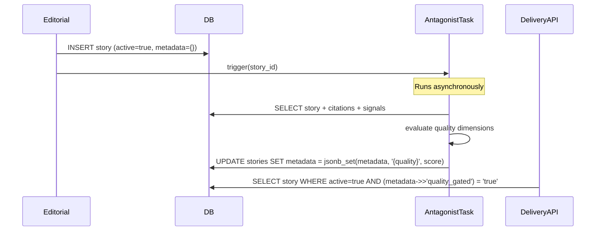

# Antagonist After Persist: Non-Blocking Adversarial Quality Gate

AIDRAN runs an adversarial quality judge — an "antagonist" — against every
generated story before that story becomes eligible for front-page placement or
briefing inclusion. The judge runs asynchronously, after the story row has
already been written to the database. This document explains why persist-first,
evaluate-second is the right ordering for an AI-generated content pipeline, and
where that ordering creates its own challenges.

## Problem

The most intuitive placement for a quality gate is before publication: generate
the story, evaluate it, and only persist it if it passes. This synchronous
blocking model has appeal — it keeps low-quality output out of the database
entirely. But it has serious practical drawbacks for a continuously running
pipeline.

Quality evaluation takes time. If the judge must approve every story before the
generation task can complete, the throughput of the entire editorial pipeline is
capped by the slowest evaluation call. On days when upstream signal volume is
high and many stories must be generated in a short window, a blocking gate
becomes a critical bottleneck.

More subtly, blocking on judge approval creates a fragile dependency. If the
judge infrastructure is unavailable — a transient error, a capacity limit, a
model update that changes evaluation behavior — the generation pipeline stops
entirely. No new stories are written. This couples two concerns that should be
independently operable: story generation and story quality assessment.

There is also a bootstrapping problem. Judge evaluation is itself a complex
process that may need to read the story's citations, its signal context, and
related stories already in the database. A story that has not yet been persisted
cannot be cross-referenced by other pipeline components during evaluation. The
judge operates more accurately when the story is a real database row with real
foreign-key relationships.

## Solution

The pipeline separates generation from evaluation into two sequential but
independent stages. The generation task inserts the story row first, then
triggers the antagonist judge as a follow-on task. The judge writes its
assessment back into the story's `metadata` jsonb column. Downstream surfaces
check the metadata field before promoting the story.

When the antagonist completes, it writes a structured result into
`metadata->quality`. The story is immediately available in the database to
other pipeline components (enrichment, search sync, related-story computation)
regardless of whether it has been evaluated yet. Front-page placement and
briefing inclusion queries add a predicate that checks for a passing quality
result in `metadata`. A story without a quality result is treated as pending —
it does not appear on public surfaces, but it also does not block anything else
from running.

This design means the `active` flag and the quality gate are orthogonal. A
story can be `active = true` (the current version, in the version chain) while
simultaneously being quality-pending (not yet eligible for front-page). The two
concerns are separated in the schema rather than merged into a single status
column.

If the antagonist judge finds a story below threshold, it writes the failing
result into metadata and optionally sets a `quality_blocked` flag. The story
remains in the database for debugging and history. A human operator or an
automated re-generation task can inspect the failing dimensions, fix the
underlying problem (insufficient signal context, a weak generation pass), and
trigger a new generation — which produces a new version row per the
append-only model, not an overwrite of the failed row.

## Tradeoffs

**Stories are transiently visible to internal pipeline consumers before
evaluation completes.** Any pipeline component that reads from the stories
table without checking the quality metadata will see unevaluated stories.
This is intentional for components like search-sync indexing and related-story
computation, which benefit from seeing all stories regardless of quality status,
but it requires delivery-facing queries to be written carefully to apply the
quality predicate.

**Quality metadata is jsonb, not a typed column.** Writing judge results into
`metadata` avoids schema migrations every time the evaluation structure changes,
but it means the shape of quality data is an implicit contract between the
antagonist task and delivery queries. Callers must know the field path and
interpret the values correctly. Documenting the quality metadata shape and
treating it as a versioned contract — even if it is not backed by a database
type — reduces this risk.

**Asynchronous evaluation creates a window of ungated content.** Between the
moment a story is persisted and the moment the antagonist result is written,
there is a period during which a hypothetical delivery consumer with no quality
predicate would serve the unevaluated story. The system relies on all
production delivery paths correctly applying the quality check. Delivery
integration tests should assert that ungated stories are not surfaced.

## See also

- [`append-only-story-versioning.md`](./append-only-story-versioning.md) —
  the antagonist writes into an existing story row's `metadata`; understanding
  the versioning model clarifies why this is a metadata update rather than a
  new version insertion.
- [`pattern-saturation-loop.md`](./pattern-saturation-loop.md) — a second
  quality feedback mechanism that operates on a different axis (voice drift
  across the corpus) and similarly feeds back into story generation without
  blocking the generation task directly.
- `packages/db/src/schema/editorial.ts` — `stories.metadata` jsonb column
  where quality results are written.
