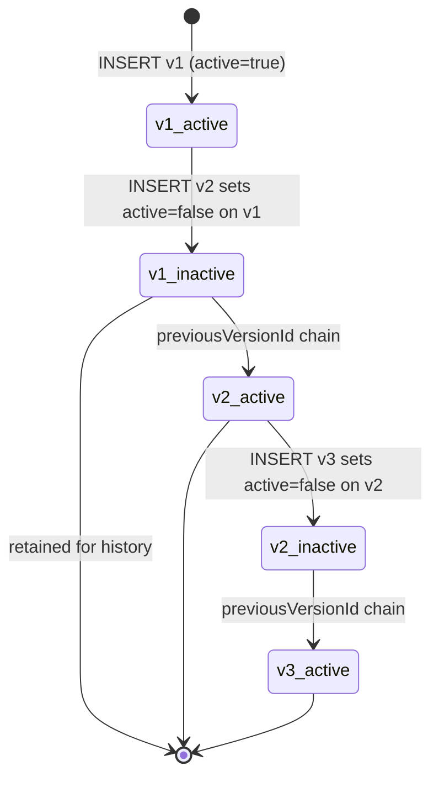

# Append-Only Story Versioning: A Publishing-Grade Record Model

Stories in AIDRAN are never updated in place. When a story is superseded by a
new version, the new version is inserted as a separate row, and a pointer links
it back to the row it replaces. This document explains why append-only
versioning is worth the storage and query complexity it introduces, and where
the approach has real costs.

## Problem

AI-generated stories need to evolve. New signals arrive, new sources are
ingested, editorial enrichment passes add citations and related-story links.
The simplest data model is a mutable row — update the `content` column, update
`updated_at`, done. But mutable rows break several downstream requirements
simultaneously.

First, readers may have bookmarked or cited a specific version of a story.
If the story's content changes silently, a reader returning to the same URL sees
a different story without knowing it has changed, and an external citer has
their reference invalidated without notice. Publishing-grade systems treat
published content as a record of what was said at a point in time.

Second, quality evaluation and debugging require knowing what was generated in
each pass. If a story's content is overwritten, the previous content is gone.
There is no way to compare the output of two different generation passes, or to
determine whether a quality regression appeared before or after a particular
enrichment run.

Third, mutable rows make it harder to gate downstream surfaces correctly. If
"is this story on the front page?" is controlled by a mutable boolean on a row
that is also being updated by the generation pipeline, a race between two
concurrent writes can produce a story that is simultaneously active and
half-enriched.

## Solution

The `stories` table uses an INSERT-only model with a linked-list version chain.
When editorial generates a new version of a story, it inserts a new row with an
incremented `version` integer and a `previous_version_id` pointing at the UUID
of the row it replaces. The slug is minted once at version 1 and copied
verbatim to every subsequent version row.

```typescript
// packages/db/src/schema/editorial.ts (abbreviated)

export const stories = pgTable('stories', {
  id: uuid('id').primaryKey().defaultRandom(), // UUIDv7 — time-ordered

  slug: text('slug'),          // minted at v1, carried forward unchanged
  version: integer('version').notNull().default(1),
  previousVersionId: uuid('previous_version_id'), // null on v1

  content: text('content').notNull(),
  headline: text('headline'),
  synopsis: text('synopsis'),

  active: boolean('active').notNull().default(true),
  generatedAt: timestamp('generated_at', { withTimezone: true })
    .notNull()
    .defaultNow(),
  publishAt: timestamp('publish_at', { withTimezone: true }),
});
```

Deactivation is handled by the `active` flag. When a new version is inserted,
the pipeline sets `active = false` on the old row. The old row is never deleted
— it remains available for history queries, diff tooling, and audit trails.
The slug uniqueness index is a partial index on `active = true` rows only,
so multiple version rows for the same slug can coexist in the table without
violating the constraint.



The `sourceRecordIds` column records the exact set of corpus records that fed
the generation context for that row, set once at insert time and never updated.
This makes each row a complete provenance artifact: you can reconstruct exactly
what the pipeline had available when it generated that specific version.

Downstream surfaces — front-page placement, briefing selection, search
indexing — filter on `active = true`. Switching a story "off" from a surface
means setting `active = false` without touching anything else. The previous
content remains intact and queryable.

## Tradeoffs

**The table grows without bound.** Every generation pass adds rows rather than
replacing them. For stories that are re-generated frequently (high-churn topics,
breaking-news beats), the version chain can accumulate dozens of rows over time.
Storage cost is generally acceptable, but queries that scan the full table
without filtering on `active` will touch more rows than expected. The
`idx_stories_active` partial index mitigates this for the hot reading path, but
analytical queries that look across all versions should be written with care.

**Advancing the version chain is not atomic by default.** Inserting the new
row and marking the old row `active = false` are two separate writes. A crash
between them leaves both rows active. The pipeline must perform these two
operations in a database transaction, and recovery tooling must be aware that
a "double-active" state is possible and correctable. The partial unique index
on slug + active will surface the violation if queried, making it detectable
rather than silent.

**History queries require traversing a linked list.** Finding all versions of a
given story means following `previous_version_id` pointers, which cannot be
expressed as a simple range scan. For deep chains this requires a recursive CTE.
The `idx_stories_version_chain` index on `(type, topic_id, version)` helps
bound the scan, but it is not a substitute for careful query design when
walking full chains.

## See also

- [`antagonist-after-persist.md`](./antagonist-after-persist.md) — quality
  evaluation happens after persist, which means the append-only row is already
  in the table when the judge runs; understanding the versioning model explains
  why the judge writes scores into `metadata` on the existing row rather than
  inserting another version.
- `packages/db/src/schema/editorial.ts` — full stories table schema including
  arc membership, citations, and content variants.
- `packages/db/src/schema/signals.ts` — signal evidence can reference a story
  UUID; the append-only model means those references remain stable even as new
  versions are published.
