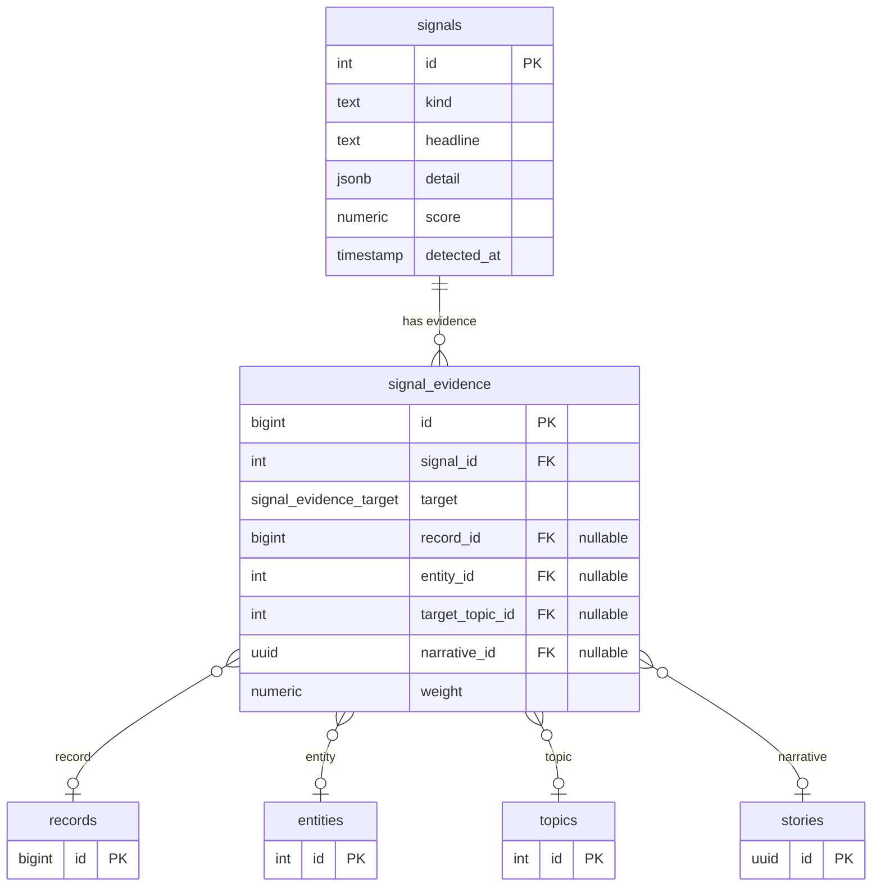

# Evidence-Joined Signals: Why Every Signal Cites Its Source

A signal in AIDRAN represents a detected pattern in the corpus — a volume
anomaly, a sentiment shift, a sudden entity surge. Signals drive editorial
prioritization: high-severity signals get promoted to story candidates. If a
signal cannot be traced back to the specific records or entities that triggered
it, the editorial output built on top of it is effectively uncitable. This
document describes the evidence-join design that makes signal provenance
first-class in the schema.

## Problem

AI-assisted pipelines are prone to hallucination at every layer, not just in
the language model step. A signal detection algorithm that summarizes its
findings into a single score column makes it impossible to verify whether the
score reflects real corpus data or an artifact of a code bug or a stale
baseline. When an editor or downstream consumer asks "why did the pipeline treat
this topic as high-urgency?", a bare numeric score offers no answer.

The problem compounds downstream. Editorial content generated from poorly
sourced signals will contain claims that cannot be checked against primary
sources. Readers and automated fact-checkers have no path from a published claim
to the raw corpus row that supports it. Retraction workflows — removing a story
because its underlying evidence was later found to be invalid — are impossible
without that link.

A secondary problem is schema flexibility. Different signal kinds point at
different corpus targets. A volume anomaly is evidenced by a set of records.
An entity surge is evidenced by entity rows. A cross-topic correlation is
evidenced by topic assignments. Embedding all of these into a single
`evidence_ids jsonb` column on the signals table would require consumers to
know which column to unpack based on the signal kind — an implicit contract
that breaks silently when a new kind is added.

## Solution

The schema separates signal metadata from signal evidence into two tables,
joined by a foreign key, with an enum column that makes the evidence target
explicit and database-enforced.

```typescript
// packages/db/src/schema/signals.ts

/** Evidence kinds the signal points at. */
export const evidenceTargetEnum = pgEnum('signal_evidence_target', [
  'record',
  'entity',
  'topic',
  'narrative', // references a previously-published story
]);

export const signalEvidence = pgTable('signal_evidence', {
  id: bigserial('id', { mode: 'bigint' }).primaryKey(),
  signalId: integer('signal_id')
    .notNull()
    .references(() => signals.id, { onDelete: 'cascade' }),
  target: evidenceTargetEnum('target').notNull(),
  recordId:    bigint('record_id', ...).references(() => records.id, ...),
  entityId:    integer('entity_id').references(() => entities.id, ...),
  targetTopicId: integer('target_topic_id').references(() => topics.id, ...),
  narrativeId: uuid('narrative_id').references(() => stories.id, ...),
  weight: numeric('weight', { precision: 6, scale: 4 }),
  metadata: jsonb('metadata').notNull().default({}),
});
```

A database-level CHECK constraint (added via migration SQL, outside of what
Drizzle can model) enforces that exactly one of the four foreign-key columns is
non-null on each evidence row:

```sql
CHECK (num_nonnulls(record_id, entity_id, target_topic_id, narrative_id) = 1)
```

This makes it impossible to insert an evidence row that is ambiguous about what
it points at. The `target` enum column acts as a discriminator, letting
consumers switch on `target` to know which FK column to follow — without any
implicit knowledge of signal kind.



The `weight` column on each evidence row lets the detection algorithm record
how much each piece of evidence contributed to the overall signal score. This
is useful for auditing — a reviewer can sort evidence rows by weight to see
which records drove the signal most strongly — and for future re-scoring when
the underlying evidence is updated.

## Tradeoffs

**More rows, more joins.** The evidence join trades column simplicity for
relational correctness. A signal with twenty supporting records produces twenty
`signal_evidence` rows, and any consumer that wants signal-plus-evidence in a
single query must join across two tables. On high-volume signal kinds this can
produce large result sets. Filtered indexes on each nullable FK column (visible
in the schema) keep individual evidence queries fast, but the join cost is
real and should be accounted for in delivery API query design.

**The CHECK constraint must be maintained as migration SQL.** Drizzle 0.36
cannot express multi-column CHECK constraints in its schema definition layer.
The constraint lives in a migration file and must be manually verified when
columns are added to `signal_evidence`. Any migration that adds a fifth FK
target column without updating the CHECK will silently break the invariant.

**The `narrative` enum value carries a historical column name.** The
`narrativeId` column references the `stories` table, but the enum value and
column name use the term `narrative` for historical reasons predating a
terminology change in the codebase. New consumers should read `narrative` as
"story" throughout the evidence schema. The column comment in the schema
clarifies this, but it is a stumbling block for first-time readers.

## See also

- [`append-only-story-versioning.md`](./append-only-story-versioning.md) —
  stories are the target of the `narrative` evidence kind; understanding story
  identity is useful context for reading signal evidence that cites a story.
- `packages/db/src/schema/signals.ts` — full schema for `signals` and
  `signal_evidence`.
- `packages/db/src/schema/analysis.ts` — `entities` and `topics` tables
  referenced by evidence FK columns.
