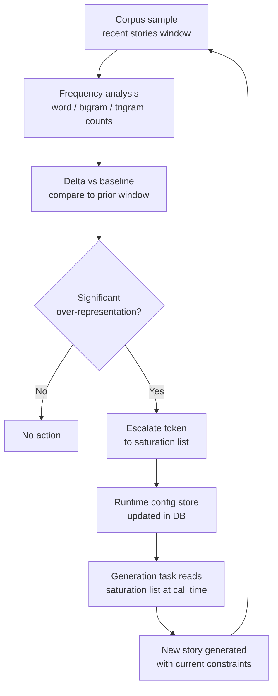
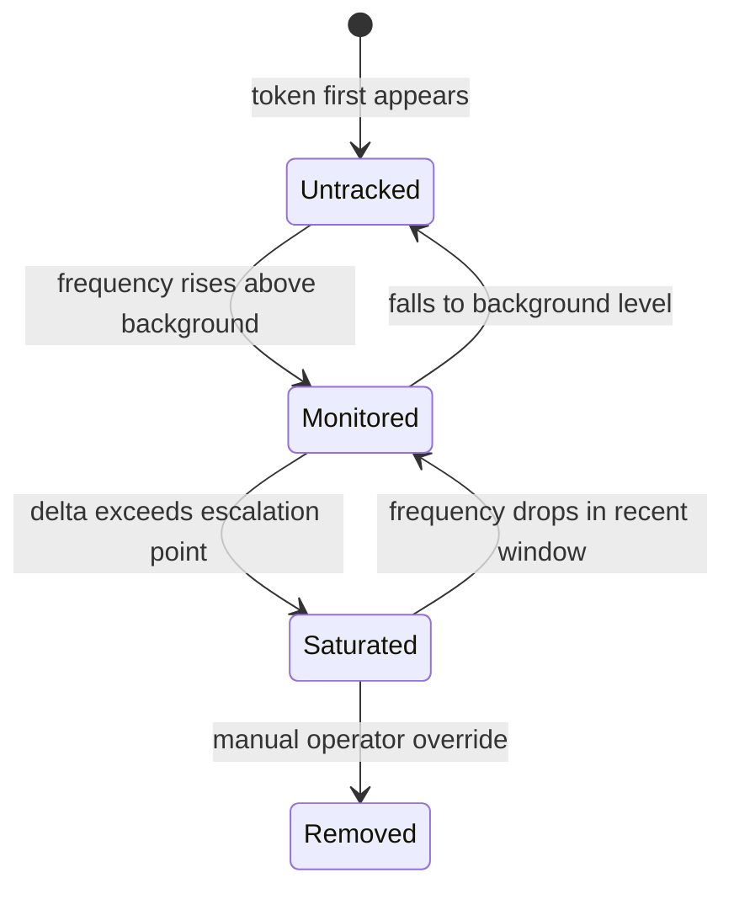

# Pattern-Saturation Loop: Automated Voice-Drift Detection

Over time, a continuously generating system drifts. Openings cluster around
the same sentence structures. Headlines favor the same construction. Transition
words recur at higher and higher frequency. Individual generation calls look
locally fine, but the corpus as a whole becomes predictable and homogeneous.
AIDRAN addresses this with a feedback loop that measures drift across the
full corpus, identifies saturated patterns, and updates the constraints that
subsequent generation reads at runtime. This document describes the
architecture of that loop.

## Problem

Language model outputs are statistically predictable: given a consistent
prompt and consistent input context, the model tends to reach for the same
syntactic patterns. This is not a failure of the model — it is working as
intended, producing fluent, well-formed prose. But fluency and variety are
different properties. A reader encountering their fifteenth AIDRAN story will
notice if they all open with the same sentence shape, or if "underscores" and
"navigates" and "remains" appear in nearly every piece.

The naive solution — adding instructions like "do not repeat yourself" to the
generation prompt — does not work at corpus scale. The model has no memory of
what it generated for previous stories. Each call starts fresh. The prompt
cannot enumerate every pattern that has saturated across the last three hundred
outputs.

A related problem is detection latency. Voice drift is not visible in any
single story. It is a statistical property of the distribution of outputs over
time. A human editor reviewing individual stories will not catch drift until it
has become severe enough to be noticeable on first read — which means it has
already affected hundreds of published pieces. An automated system can measure
drift continuously and intervene earlier.

The challenge is that "saturation" is relative. A word or structure that
appears frequently in the source corpus (because the AI discourse being
ingested uses it heavily) should not be flagged as saturated editorial output
just because it is common. The measurement must compare editorial output to an
appropriate baseline — not to a static wordlist that encodes one developer's
stylistic preferences.

## Solution

The saturation loop runs as a periodic background task. It does not block
generation; it runs independently and feeds its output into a runtime
configuration store that generation reads at the start of each call.

The loop compares two corpus windows: a recent window (stories generated in the
last N days) and a baseline window (stories from a prior reference period). For
each n-gram, it computes a frequency delta — how much more (or less) often the
token appears in the recent window relative to the baseline. Tokens whose delta
exceeds the escalation threshold are added to the active saturation list.

In addition to token-level frequency, the loop measures structural patterns:
opening sentence shapes (subject-verb agreement patterns at the clause level),
closing constructions, and headline syntactic templates. These are represented
as normalized fingerprints rather than raw strings, so "The situation is X" and
"The landscape is Y" and "The environment is Z" resolve to the same opening
template and are tracked together.

The saturation list is stored in the database as runtime configuration. The
generation task reads it at the start of each call, not at deploy time. This
means a newly saturated token becomes a constraint for the next generation
call without any code deployment or pipeline restart. It also means the list
can be inspected, audited, and manually adjusted by an operator without
touching application code.

When a token falls out of saturation — because recent generation has naturally
diversified away from it, or because enough time has passed that it no longer
appears in the recent window — the loop removes it from the active list. The
saturation list is a dynamic, continuously updated artifact, not a permanent
ban.

## Tradeoffs

**The loop operates on a sample, not the full corpus.** Computing frequency
distributions over the entire story history on every run would be
computationally expensive and produce a baseline dominated by very old content
that may no longer reflect current editorial intent. Using a rolling window
keeps the computation bounded and the baseline current, but it means the loop
can only detect drift relative to the recent past. A pattern that was already
saturated when the system was launched will not be detected unless a pre-launch
baseline is available.

**Structural pattern matching is approximate.** Normalizing sentence shapes
into fingerprints requires heuristics — part-of-speech approximations, clause
boundary detection — that will sometimes produce false positives (flagging a
legitimate sentence structure as a template) and false negatives (missing a
pattern that is genuinely repetitive but syntactically varied). The loop is a
signal, not a verdict. Human editorial review of the saturation list catches
false positives before they become over-constrained generation prompts.

**Feedback lag is inherent.** The loop measures the recent window with some
delay — it can only detect saturation in stories that have already been
generated and written to the corpus. There is no mechanism for detecting
saturation before it occurs. The practical effect is that a new pattern can
saturate across a batch of stories before the next loop run escalates it. Tuning
the loop's run frequency and window size controls this lag but cannot eliminate
it entirely. Frequent short runs catch saturation faster but at higher
computational cost.

## See also

- [`antagonist-after-persist.md`](./antagonist-after-persist.md) — the
  antagonist evaluates individual story quality; the saturation loop evaluates
  corpus-level drift. The two mechanisms are complementary and both feed
  constraints into subsequent generation without blocking it.
- [`append-only-story-versioning.md`](./append-only-story-versioning.md) —
  the corpus sample that the saturation loop reads is drawn from the `stories`
  table; the append-only model means both active and superseded versions are
  available for historical comparison, and the loop should filter on `active =
  true` unless intentionally sampling version history.
- `packages/db/src/schema/editorial.ts` — `stories` table that the saturation
  loop reads for its corpus sample.
