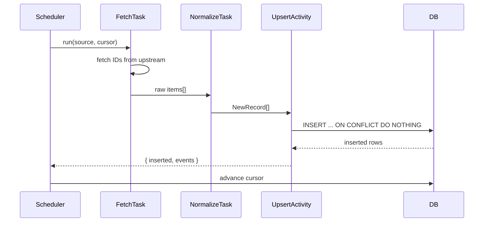

# Service with Cursor: The Unified Ingestion Pattern

Each source connector in AIDRAN follows a single, composable structure: a task
that owns a per-source cursor, scans a bounded recent window, writes new records
through a shared upsert activity, and then advances the cursor. This document
describes that pattern, its motivations, and where it can strain.

## Problem

AI-discourse pipelines consume from many heterogeneous sources simultaneously —
discussion forums, preprint servers, social platforms, news APIs. Each source has
a different pagination model, a different concept of "new", and a different
failure mode when the upstream is unavailable. The naive approach writes one
bespoke orchestration loop per source, each with its own bookmark persistence,
retry logic, and conflict-handling code. That approach scales poorly: adding a
new source requires authoring a new orchestration path from scratch, and bugs in
one connector's bookmarking tend to duplicate across all connectors.

The deeper problem is idempotency. Ingestion tasks are retried when they fail
mid-run. Without a stable cursor and an idempotent write path, a retry produces
duplicate records that corrupt downstream signal detection and editorial output.
Idempotency cannot be an afterthought bolted onto an existing loop — it must be
structural.

A related problem is observability. When ten connectors each persist their own
cursor in a private format, diagnosing lag ("why hasn't arXiv ingested in six
hours?") requires knowing each connector's private cursor format. A single shared
pattern gives operators a single mental model to query.

## Solution

Each source connector is implemented as a set of discrete, reusable activities
rather than a monolithic loop:

1. **Fetch IDs** — retrieve a bounded list of candidate item IDs from the
   upstream source for a recent time window.
2. **Fetch item batch** — hydrate each ID into a structured item, with
   concurrency controlled to respect rate limits.
3. **Normalize and upsert** — convert items into the canonical `NewRecord` shape
   and write them through the shared `upsertRecords` activity, which uses
   `ON CONFLICT DO NOTHING` so retries are safe.
4. **Advance cursor** — persist the high-water mark for this source so the next
   run knows where to start.

The Hacker News connector illustrates the fetch-normalize-upsert leg of this
pattern directly:

```typescript
// services/ingestion/src/activities/hackernews.ts

/** Normalize HN items and upsert into the records table. */
export async function insertHnItems(
  db: Database,
  input: InsertHnItemsInput,
): Promise<InsertHnItemsOutput> {
  const normalized: NormalizedItem[] = [];

  for (const item of input.items) {
    if (item.type !== 'story' && item.type !== 'comment') continue;
    if (!item.by) continue; // deleted author

    normalized.push({
      source: 'hackernews',
      sourceId: input.sourceId,
      contentType: item.type === 'story' ? 'post' : 'comment',
      externalId: String(item.id),
      // ...remaining canonical fields
    });
  }

  const batch = normalized.map(toNewRecord);
  return upsertRecords(db, batch);
}
```

The `upsertRecords` activity is the key seam. It inserts with an explicit
conflict target on `(kind, external_id)`, so any number of retries produce
exactly the same database state:

```typescript
// services/ingestion/src/activities/upsert-records.ts

await db
  .insert(records)
  .values(batch)
  .onConflictDoNothing({ target: [records.kind, records.externalId] })
  .returning({ id: records.id, kind: records.kind, ... });
```

Adding a new source means implementing the fetch and normalize steps for that
source's API, then wiring the result into `upsertRecords`. The idempotency,
conflict semantics, and cursor persistence are inherited automatically.



## Tradeoffs

**Bounded windows trade completeness for predictability.** The pattern scans a
recent window rather than attempting a full historical backfill on every run.
This keeps individual runs fast and bounded in cost, but it means a source that
goes dark for longer than the window size will have a gap in coverage when it
comes back online. Sources with irregular publish cadence (low-volume academic
preprint servers, for example) need larger windows or a separate backfill task.

**Cursor advancement is not transactional with the upsert.** If the task fails
between completing the upsert and persisting the new cursor position, the next
run will re-fetch and re-attempt the same window. The `ON CONFLICT DO NOTHING`
semantics make re-attempts safe, but they impose a small overhead — rows that
were already inserted are fetched, normalized, and passed to the database again
before being silently dropped. For high-volume sources this overlap should be
minimized by keeping cursor advancement as the very last step and making the
window small.

**All sources share a single `records` schema.** The canonical `NewRecord` shape
is the contract between connectors and downstream consumers. Sources with richer
structured metadata (thread trees, upvote trajectories, embedded media) must
either flatten that information into `sourceMetadata: jsonb` or lose it. If a
downstream service needs thread-native structure for a specific source,
`sourceMetadata` is available, but querying jsonb at scale is less efficient than
dedicated columns.

## See also

- [`evidence-joined-signals.md`](./evidence-joined-signals.md) — downstream
  consumers of ingested records use signals with explicit evidence rows,
  continuing the theme of explicit provenance at every layer.
- `packages/db/src/schema/records.ts` — canonical `records` table schema.
- `services/ingestion/src/activities/upsert-records.ts` — shared upsert activity.
- `services/ingestion/src/activities/hackernews.ts` — reference connector
  implementation.
